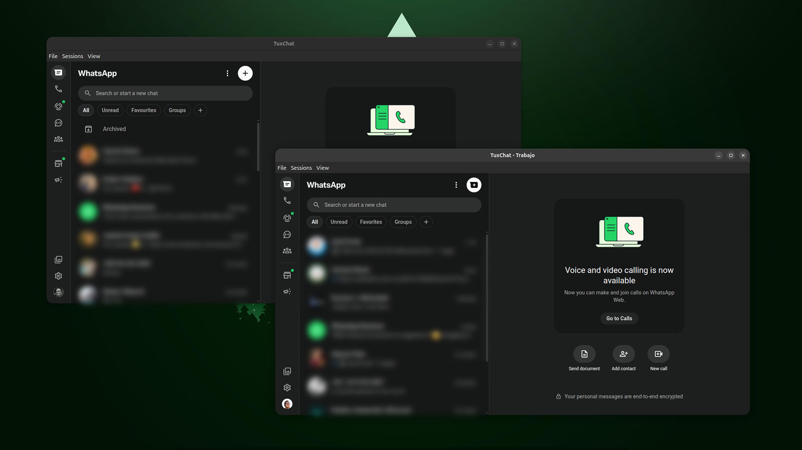
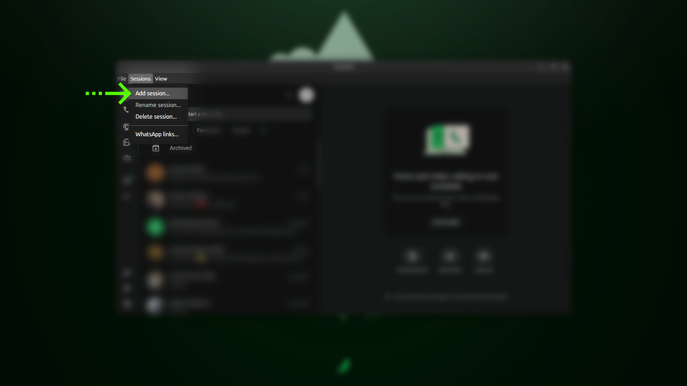
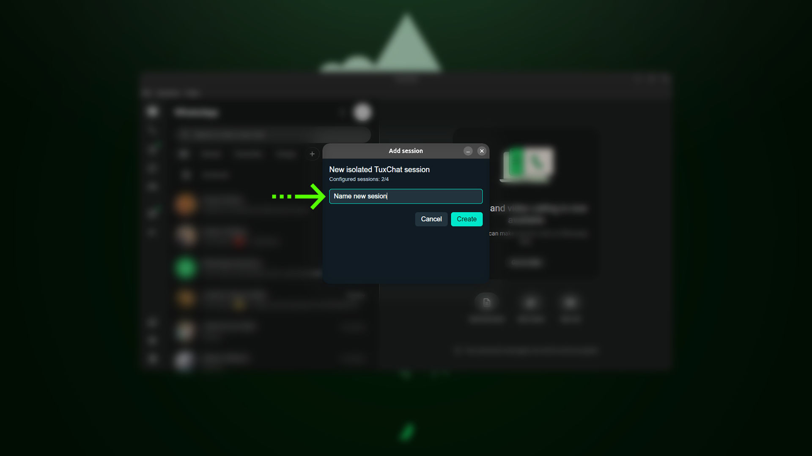
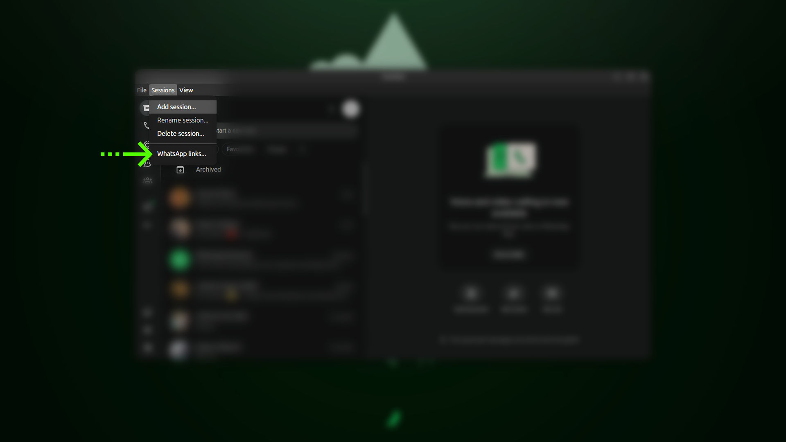
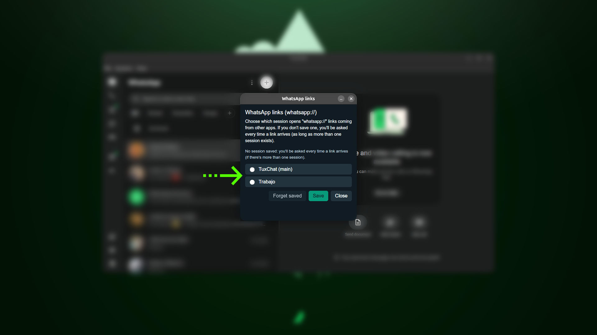

# TuxChat


[English](README.md) · **Español**

Cliente de escritorio no oficial de WhatsApp Web para Linux (Electron), con
soporte completo de llamadas/video y screen share, múltiples sesiones
aisladas en paralelo, y soporte de enlaces `whatsapp://`.

**Estado: en desarrollo temprano (v0.2), no listo para uso diario.**

Probado en Ubuntu 26.04 con GPU NVIDIA. Debería funcionar en otras
distros/GPUs (el `.deb` solo depende de librerías estándar de
GTK/Debian, y `--ozone-platform=x11` solo se fuerza si detecta NVIDIA en
Wayland), pero todavía no está verificado — reportes de otros entornos son
bienvenidos.

## Capturas



| | |
|---|---|
|  |  |
| **1.** Sessions → Add session… | **2.** Nombrá la nueva sesión aislada |
|  |  |
| **3.** Sessions → WhatsApp links… | **4.** Elegí qué sesión abre los enlaces `whatsapp://` |

## Instalación

Descargá el instalador desde
[Releases](https://github.com/histerick/tuxchat/releases):

- **Ubuntu/Debian:** `tuxchat_<version>_amd64.deb` — `sudo apt install ./tuxchat_<version>_amd64.deb`, o doble clic para abrirlo con el instalador de software.
- **Cualquier otra distro:** `TuxChat-<version>.AppImage` — dale permiso de ejecución y corrélo directo, no requiere instalación ni `libfuse2` (distros recientes como Ubuntu 24.04+ ya no lo traen por defecto).

### Actualizaciones

- **AppImage:** se actualiza solo, en segundo plano — revisa si hay versión nueva al abrir y cada 4 horas mientras corre, la descarga sin interrumpir, y la instala la próxima vez que cerrás la app. Al abrir después de actualizar, muestra una ventana única con las novedades de esa versión.
- **.deb:** no se autoactualiza (lo maneja `apt`) — bajá el paquete nuevo desde [Releases](https://github.com/histerick/tuxchat/releases) cuando salga uno.

## Múltiples sesiones

Desde el menú de la ventana: **Sesiones > Añadir sesión...** crea una
sesión de WhatsApp completamente aislada (login, caché y datos propios),
con su propio ícono y entrada en el menú de aplicaciones. **Renombrar** y
**Eliminar** funcionan igual, desde el mismo menú.

## Enlaces de WhatsApp (whatsapp://)

TuxChat se registra ante el sistema como manejador del esquema
`whatsapp://`, así que un link tipo `wa.me/<numero>` o
`whatsapp://send?phone=...&text=...` clickeado desde cualquier otra app
(navegador, mail, etc.) abre el chat directo en TuxChat, en vez de quedar
atrapado en la versión de WhatsApp del navegador. Con más de una sesión
configurada, la primera vez pregunta con cuál abrirlo (con opción de
recordar la elección); se administra desde **Sesiones > Enlaces de
WhatsApp...**.

## Enlaces dentro de los chats

Los enlaces que llegan en un chat (Zoom, Google Meet, cualquier página
web) se abren en tu navegador predeterminado — como pestaña nueva si ya
está abierto — en vez de en una ventana emergente de TuxChat.

## Desarrollo

```bash
npm install
npm start
```

La bitácora de desarrollo detallada vive fuera de este repo mientras el
proyecto madura; ver `tuxchat.md` en el equipo de desarrollo.
